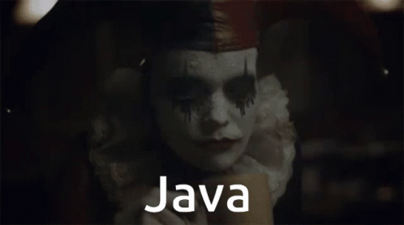

# Maratona Java


| Versão do Java | Documentação                                 | 
|----------------|----------------------------------------------|
| 17             | [Java doc](https://docs.oracle.com/en/java/) |

```
System.println.out("Vamos começar");
```
## 📒Topicos:
 - [Introdução a classes](https://github.com/leomoreiradev/Maratona-Java/tree/main/src/main/java/com/leomoreiradev/javacore/Aintroducaoclasses)
